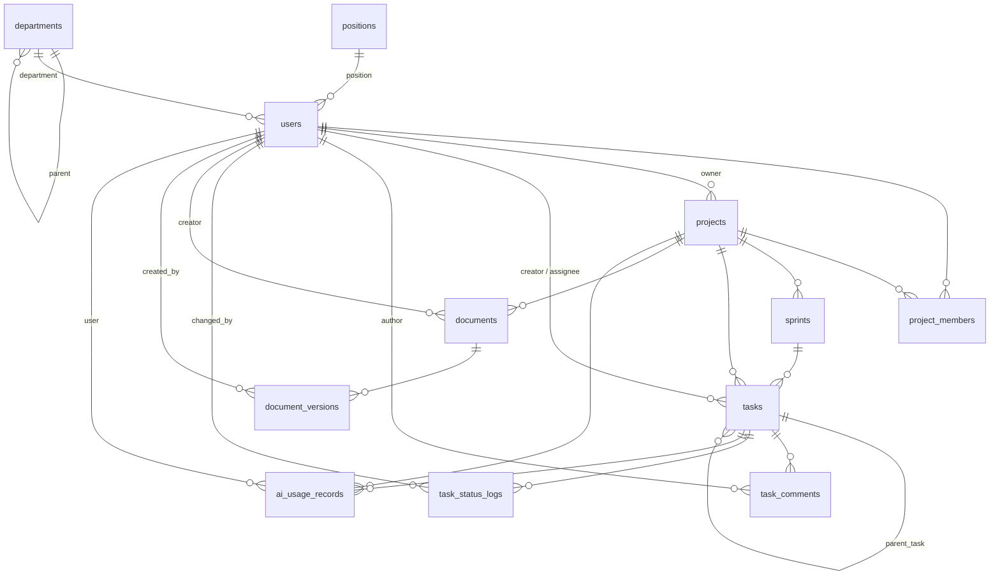

# Database Schema — taskpilot-ai-api

> PostgreSQL · UUID 主键 · TIMESTAMPTZ

## 约定

| 规则   | 说明                                                                                             |
| ------ | ------------------------------------------------------------------------------------------------ |
| 主键   | 所有表使用 `UUID`，默认 `gen_random_uuid()`                                                      |
| 时间戳 | 统一 `TIMESTAMPTZ`，默认 `NOW()`                                                                 |
| 枚举   | 使用 `VARCHAR(20)` + `CHECK` 约束，不用 PostgreSQL ENUM（便于扩展）                              |
| 索引   | 外键列、高频查询列均建索引                                                                       |
| 删除   | 所有表通过 `status BOOLEAN` 标记：`TRUE` 正常 / `FALSE` 已删除，查询默认加 `WHERE status = TRUE` |

---

## Entity-Relationship Diagram

---

## 表目录

### 用户

| 表                                   | 说明                 |
| ------------------------------------ | -------------------- |
| [users](tables/users.md)             | 用户账户             |
| [departments](tables/departments.md) | 部门（支持树形层级） |
| [positions](tables/positions.md)     | 职位                 |

### 项目管理

| 表                                           | 说明            |
| -------------------------------------------- | --------------- |
| [projects](tables/projects.md)               | 项目            |
| [project_members](tables/project_members.md) | 项目成员及角色  |
| [sprints](tables/sprints.md)                 | Sprint 迭代规划 |

### 任务管理

| 表                                             | 说明                                    |
| ---------------------------------------------- | --------------------------------------- |
| [tasks](tables/tasks.md)                       | 任务（含子任务、Sprint 归属、状态流转） |
| [task_comments](tables/task_comments.md)       | 任务评论                                |
| [task_status_logs](tables/task_status_logs.md) | 状态变更审计日志                        |

### 文档管理

| 表                                               | 说明                        |
| ------------------------------------------------ | --------------------------- |
| [documents](tables/documents.md)                 | 文档（项目文档 + 个人文档） |
| [document_versions](tables/document_versions.md) | 文档版本历史                |

### AI 使用情况

| 表                                             | 说明                             |
| ---------------------------------------------- | -------------------------------- |
| [ai_usage_records](tables/ai_usage_records.md) | AI 调用记录（token 用量 + 费用） |

---

## 索引汇总

| 表                  | 索引                                                                                                                                         | 用途                                |
| ------------------- | -------------------------------------------------------------------------------------------------------------------------------------------- | ----------------------------------- |
| `users`             | `email`, `role`, `department_id`, `position_id`                                                                                              | 登录查询、角色筛选、按部门/职位查询 |
| `departments`       | `name`, `parent_department_id`                                                                                                               | 部门树查询                          |
| `positions`         | `name`                                                                                                                                       | 职位名称查询                        |
| `projects`          | `owner_id`, `status`, `project_status`, `project_code` UNIQUE                                                                                | 按负责人/状态筛选、编码查询         |
| `sprints`           | `project_id`, `status`, `start_date, end_date`                                                                                               | Sprint 列表、状态筛选、日期范围     |
| `project_members`   | `project_id`, `user_id`, `(project_id, user_id)` UNIQUE                                                                                      | 成员查询、去重                      |
| `tasks`             | `project_id`, `task_code` UNIQUE, `sprint_id`, `parent_task_id`, `status`, `task_state`, `priority`, `creator_id`, `assignee_id`, `due_date` | 多维筛选排序、编码查询              |
| `task_comments`     | `task_id`, `author_id`                                                                                                                       | 评论列表                            |
| `task_status_logs`  | `task_id`, `changed_by`, `changed_at`                                                                                                        | 状态时间线                          |
| `documents`         | `project_id`, `document_code` UNIQUE, `creator_id`, `status`, `updated_at DESC`                                                              | 文档列表、编码查询、活跃过滤        |
| `document_versions` | `document_id`, `(document_id, version_number)` UNIQUE                                                                                        | 版本历史                            |
| `ai_usage_records`  | `user_id`, `project_id`, `task_id`, `model_name`, `created_at DESC`, `(user_id, created_at DESC)`                                            | 用量报表、用户维度聚合              |

---

## 补充建议

- **`updated_at` 自动更新**: 创建触发器函数，`BEFORE UPDATE` 时自动 `SET updated_at = NOW()`。
- **全文搜索**: 对 `tasks.title`、`tasks.description`、`documents.title`、`documents.content` 可建 `tsvector` 列 + GIN 索引。
- **分页**: 涉及列表查询建议使用 keyset pagination（`WHERE created_at < $cursor ORDER BY created_at DESC`），避免 `OFFSET` 在大数据量下的性能问题。
